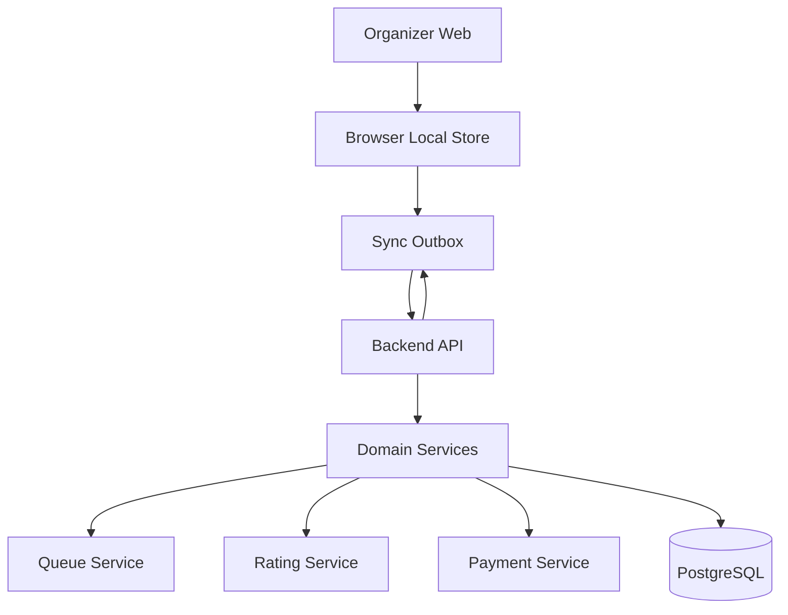
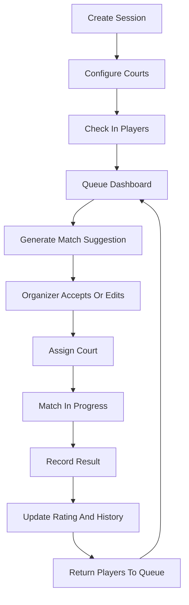
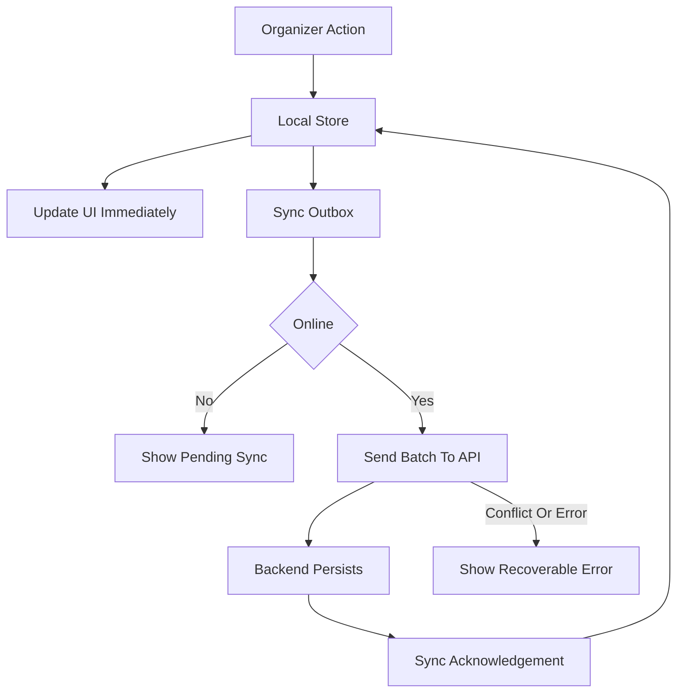

# Architecture Spec

## System Purpose

Top Seed is a mobile and tablet responsive web app for running badminton open-play sessions. The MVP is organizer-centric: the queue master should be able to run check-ins, courts, queue assignments, match results, player records, and manual payment tracking from one live dashboard.

## MVP Boundaries

In scope:

- Badminton open-play sessions, primarily doubles.
- Organizer-managed sessions, courts, players, queue, matches, results, ratings, and manual payments.
- Organizer-managed player check-in, player records, leaderboard, and match history.
- Lightweight internal ratings for fair match suggestions.
- Local-first offline resilience for live session operation on one organizer device.

Out of scope:

- Login, account management, and role-based access.
- Player self-service check-in, current status, upcoming match, and player-owned profile pages.
- Online payment processing.
- Tournament brackets and full league scheduling.
- Native mobile applications.
- Court booking integrations.
- Multi-sport configuration abstractions.
- Public Elo claims or official ranking systems.

## Recommended Application Shape

Use a local-first responsive web architecture with a browser local store, sync outbox, backend API, relational database, and simple connectivity recovery path.

## Application Areas

- Organizer app: session setup, live dashboard, court board, queue, payments, match results, player management.
- Organizer reporting: leaderboard and match history.
- Local-first runtime: browser local store, pending action outbox, connection/sync status, and exportable backup.
- Backend API: organizations/workspace, sessions, check-ins, courts, matches, payments, queue suggestions, ratings, leaderboard.
- Domain services: queue generation, rating updates, payment state transitions, session consistency checks, and sync validation.

## Core Domain Flow

## Data Consistency Rules

- A player can have only one active `checkIn` per active `session`.
- A court can have at most one active match.
- A checked-in player can be in only one of these live states: `waiting`, `assigned`, `playing`, `resting`, `done`, or `removed`.
- A match result should update match history and rating history atomically.
- Payment status belongs to a session-level check-in, not the global player profile.

## Offline And Sync Strategy

MVP v1 must keep a live session usable during temporary disconnection. The browser local store is the source of truth while the organizer is offline or while actions are pending sync. The backend becomes authoritative after queued actions sync successfully.

Required offline-capable operations:

- View the active session dashboard.
- Add and edit players.
- Check players in and update queue status.
- Add, pause, reopen, and mark courts unavailable.
- Assign courts and manage active matches.
- Generate match suggestions from cached local session state.
- Start and finish matches.
- Record scores and results.
- Track manual payments.
- View cached leaderboard and match history.
- Queue local actions for later sync.

Sync model:

MVP limitations:

- Best for one organizer device per live session.
- Cross-device sync and concurrent organizers are not required.
- Cloud backup only happens after connectivity returns.
- Clearing browser data can remove unsynced local changes unless the organizer exports a backup.
- The app should warn before destructive browser-storage actions when possible.

## Realtime Strategy

Start with local-first state updates and background sync. Server polling or server-sent events can refresh server snapshots when online. Move to WebSockets only when concurrent organizer editing or public live boards become necessary.

The organizer dashboard should refresh these data sets together:

- Active courts and matches.
- Waiting and resting players.
- Suggested next matches.
- Payment status counts.
- Recently completed matches.

## MVP Access Model

MVP v1 has no login component. Treat the app as a single organizer-operated workspace. The organizer manually manages players, sessions, courts, payments, match results, leaderboard, and match history.

Implementation may still keep internal fields that can later connect to authenticated users, but v1 screens should not require sign-in, player accounts, or guest access links.

## Future Direction

Future versions may add:

- Organizer login and organization membership.
- Player accounts.
- Player self-service check-in through QR or shared links.
- Player current status and upcoming match views.
- Player-owned match history and profile pages.
- Public or player-facing leaderboard access.

When adding these, update auth, route, API, and permission specs in the same change.

## Quality Bar

- Queueing behavior must be testable and deterministic.
- Payment transitions must be auditable.
- Organizer overrides must be recorded as ordinary match assignments.
- The app should remain usable on a tablet beside the courts with high visual clarity and low typing.
