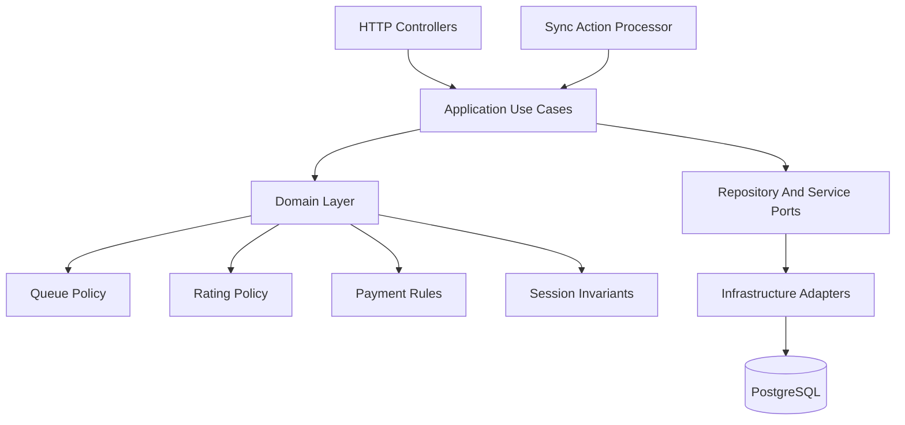
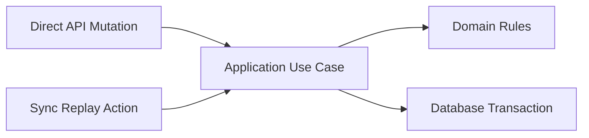

# Backend Architecture Spec

## Recommendation

Use a Clean Architecture inspired modular monolith for MVP v1.

The backend should be one deployable application with strong internal boundaries. Do not split into microservices for MVP. The domain is still changing, and the product needs fast iteration across sessions, courts, queue lanes, queued matches, payments, ratings, history, and offline sync.

Clean Architecture is useful here because Top Seed will likely add major future capabilities: organizer login, player accounts, player self-service, online payments, public leaderboards, multi-device sync, and richer auto-queueing. The MVP should stay simple, but not tangled.

## Architectural Goals

- Keep badminton business rules independent from HTTP, database, and framework details.
- Make queueing, ratings, payments, and session invariants testable without running a server.
- Support offline sync replay without duplicating business logic.
- Keep modules easy to extract later if the product grows.
- Prefer explicit use cases over controllers that directly mutate database records.
- Keep the deployment and operational model boring for MVP.

## System Shape



## Layers

### Domain Layer

The domain layer contains pure business concepts and rules.

Allowed:

- Entities and value objects.
- Domain services and policies.
- Invariant checks.
- Deterministic queue scoring.
- Rating calculations.
- Payment state rules.
- Session, court, queue lane, queued match, and match state transitions per `docs/specs/backend/state-transitions.md`.

Not allowed:

- HTTP request or response objects.
- ORM models.
- SQL queries.
- Framework decorators.
- Network calls.
- Environment variables.

Examples:

- `canDeleteQueueLane(session, lane, queuedMatches)`
- `promoteQueuedMatchToCourt(session, queuedMatch, court)`
- `generateDoublesSuggestion(snapshot, policy)`
- `calculateRatingDelta(completedMatch)`
- `validatePaymentTransition(currentStatus, nextStatus)`

### Application Layer

The application layer contains use cases. A use case represents one organizer workflow or sync-replayable mutation.

Responsibilities:

- Load required records through repository ports.
- Call domain rules.
- Coordinate transactions.
- Persist state changes.
- Create audit or idempotency records when needed.
- Return application results that controllers can map to API responses.

Examples:

- `CreateSession`
- `CheckInPlayer`
- `CreateCourt`
- `PauseCourt`
- `CreateQueueLane`
- `DeleteQueueLane`
- `CreateQueuedMatch`
- `MoveQueuedMatchToLane`
- `PromoteQueuedMatchToCourt`
- `StartMatch`
- `CompleteMatch`
- `MarkPayment`
- `GenerateQueueSuggestion`
- `ProcessSyncActions`

Rules:

- Controllers and sync processors must call application use cases instead of mutating repositories directly.
- Use cases should be small enough to test as workflows.
- Use cases should own transaction boundaries.
- Use cases should accept client-generated IDs or idempotency keys where offline replay can occur.

### Interface Layer

The interface layer adapts external inputs to application use cases.

MVP interfaces:

- HTTP controllers or route handlers.
- Request validation.
- Response presenters.
- Sync action deserialization.

Rules:

- Keep controllers thin.
- Validate request shape before calling a use case.
- Do not put business rules in controllers.
- Do not return ORM records directly.
- Convert application errors into the API error shape from `docs/specs/backend/api-spec.md`.

### Infrastructure Layer

The infrastructure layer implements technical details.

Allowed:

- Database schema and migrations.
- Repository implementations.
- ORM or query builder models.
- Transaction manager.
- Idempotency store.
- Clock and ID generation adapters.
- Background job adapters if needed later.

Rules:

- Infrastructure depends inward on application ports and domain types.
- Domain and application layers must not depend on concrete infrastructure.
- Database constraints should reinforce domain invariants, not replace application/domain validation.

## Module Organization

Prefer domain modules with internal layer boundaries.

Suggested structure:

```text
backend/
  src/
    modules/
      organizations/
      players/
      sessions/
      courts/
      queue/
      matches/
      payments/
      ratings/
      sync/
      leaderboards/
    shared/
      domain/
      application/
      infrastructure/
      http/
```

Within a module:

```text
queue/
  domain/
    queue-lane.ts
    queued-match.ts
    queue-policy.ts
  application/
    create-queue-lane.ts
    delete-queue-lane.ts
    create-queued-match.ts
    move-queued-match-to-lane.ts
    promote-queued-match-to-court.ts
    generate-queue-suggestion.ts
  infrastructure/
    queue-repository.ts
  http/
    queue-routes.ts
```

Use file names and class/function names that match product language from `AGENTS.md`.

## Sync Architecture

Offline sync must be a first-class application concern.

Normal HTTP mutations and sync replay should share the same use cases:



Rules:

- `ProcessSyncActions` validates action order, idempotency, and per-action results.
- Each sync action maps to a use case from the catalog in `docs/specs/backend/sync-actions.md`.
- Applying the same sync action twice must not duplicate effects.
- Failed sync actions should return actionable error codes.
- Later actions that depend on a failed action should be marked `blocked`.
- Independent actions should continue when safe, even if an earlier unrelated action failed.
- Sync replay must preserve session action order unless an action type is explicitly independent.

Do not create separate sync-only business logic that bypasses the ordinary application use cases.

## Transaction Boundaries

Use application use cases as the default transaction boundary.

Atomic workflows:

- Check in a player and assign arrival order.
- Delete a queue lane and remove queued matches inside it.
- Promote a queued match to a court match.
- Complete a match, update match history, release players, and create rating history.
- Mark payment and update session payment summary if summary data is persisted.

Read-only queries can use optimized read models later, but MVP should favor correctness and clarity.

## Error Handling

Use explicit application errors that can be mapped to API responses.

Examples (full registry: `docs/specs/backend/api-contracts.md` § Error Code Registry):

- `SESSION_NOT_ACTIVE`
- `PLAYER_ALREADY_CHECKED_IN`
- `COURT_ALREADY_OCCUPIED`
- `QUEUE_LANE_REQUIRED`
- `QUEUED_MATCH_INCOMPLETE`
- `PLAYER_ALREADY_ASSIGNED`
- `INVALID_PAYMENT_TRANSITION`
- `SYNC_ACTION_ALREADY_APPLIED`

Rules:

- Domain errors should be precise and user-recoverable when possible.
- Controllers should not invent error codes outside the registry without updating `api-contracts.md`.
- Sync responses must report success or failure per action.

## Testing Expectations

Domain tests:

- Queue suggestion determinism.
- Queue lane deletion rules.
- Queued match promotion rules.
- Court occupancy invariants.
- Payment transitions.
- Rating calculations.

Application tests:

- Use case transactions.
- Idempotent replay.
- Sync batch partial failure behavior.
- Match completion side effects.
- Deleting non-empty queue lanes.

Interface tests:

- Request validation.
- API error mapping.
- Response shape for dashboard queries.

Infrastructure tests:

- Repository persistence.
- Database constraints.
- Migration compatibility.

## Future Extraction Rules

Do not extract services during MVP. Consider extraction only when:

- A module has a separate scaling profile.
- The team has clear operational ownership boundaries.
- The module has a stable public contract.
- Database ownership can be separated safely.

Likely future candidates, if the product grows:

- Realtime/public live boards.
- Online payments.
- Notification delivery.
- Analytics/reporting.

Queueing, sessions, courts, matches, and ratings should stay together until the core session-running workflow is mature.

## Review Checklist

Before accepting backend code:

- Does the domain rule live outside the controller?
- Can the main use case be tested without HTTP?
- Does offline sync replay use the same use case as the direct mutation?
- Are idempotency keys handled for replayable actions?
- Are transaction boundaries explicit?
- Are database constraints reinforcing the same invariants?
- Does the module use Top Seed domain language consistently?
