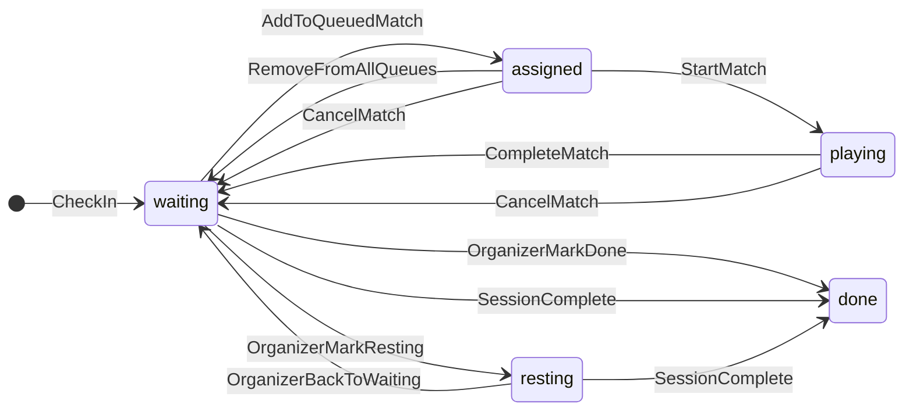

# State Transitions Spec

## Purpose

Define what changes when the organizer performs a live-session action. This file is the source of truth for pegboard behavior: how players, queued matches, court matches, courts, and sessions move between states.

Related specs:

- Entity fields and relationships: `docs/specs/backend/domain-model.md`
- Sync action names and payloads: `docs/specs/backend/sync-actions.md`
- Match outcomes and rating effects: `docs/specs/backend/match-results-and-ratings.md`
- Match assignment pipeline: `docs/specs/backend/queueing-and-ratings.md` (Match Assignment Pipeline)

## Pegboard Mapping

The live session dashboard follows a physical pegboard mental model:

```text
Available (PlayerPool)  →  Next (NextQueuePanel)  →  Now (CourtBoard)
```

| Pegboard area | Primary entities | What organizer sees |
|---------------|------------------|---------------------|
| `Available` | `CheckIn` with `waiting` or `resting` | Players ready to stage or manually resting |
| `Next` | `QueuedMatch` in `draft` or `ready` | Future matchups lined up in queue lanes |
| `Now` | `Match` on `Court` | Team slots, start/finish actions, live play |

Players with `assigned` or `playing` status appear on Next-lane cards and/or court cards, not in Available tabs.

## Status Precedence

When one check-in participates in multiple contexts, derive `queueStatus` using this precedence:

1. `playing`
2. `assigned`
3. `waiting`
4. `resting`
5. `done`
6. `removed`

Example: a player staged in a queue lane (`assigned`) who is not on court remains `assigned`. A player on court after `START_MATCH` is `playing` even if still listed elsewhere until duplicate slots are cleared.

## Player Transitions (`CheckIn.queueStatus`)

| Trigger | From | To | Sync action / API |
|---------|------|-----|-------------------|
| Check in player | — | `waiting` | `CHECK_IN_PLAYER` |
| Add player to queued match | `waiting`, `resting` | `assigned` | `CREATE_QUEUED_MATCH`, `UPDATE_QUEUED_MATCH` |
| Remove player from queued match (still in other queue or court) | `assigned` | `assigned` | `UPDATE_QUEUED_MATCH` |
| Remove player from all queues and court roster | `assigned` | `waiting` | `UPDATE_QUEUED_MATCH`, `REMOVE_QUEUED_MATCH` |
| Promote queued match to court | `assigned` | `assigned` | `MOVE_QUEUED_MATCH_TO_COURT` |
| Direct assign to court | `waiting`, `resting` | `assigned` | `CREATE_MATCH` |
| Start match | `assigned` | `playing` | `START_MATCH` |
| Complete match (any scored outcome) | `playing` | `waiting` | `COMPLETE_MATCH` |
| Complete match while still in another `draft`/`ready` queued match | `playing` | `assigned` | `COMPLETE_MATCH` |
| Cancel match | `assigned`, `playing` | `waiting` | `CANCEL_MATCH` |
| Organizer: mark resting | `waiting` | `resting` | `UPDATE_CHECK_IN` |
| Organizer: back to waiting | `resting` | `waiting` | `UPDATE_CHECK_IN` |
| Organizer: mark done | any except `playing` | `done` | `UPDATE_CHECK_IN` |
| Organizer: remove from session | any except `playing` | `removed` | `REMOVE_CHECK_IN` |
| Restore check-in | `removed` | `waiting` | `RESTORE_CHECK_IN` |
| Session complete | `waiting`, `resting` | `done` | `POST .../complete` |
| Session cancel | all active check-ins | frozen read-only | `POST .../cancel` |

### Post-Match Queue Policy

- After `COMPLETE_MATCH`, all participants return to `waiting` immediately.
- `resting` is **organizer-initiated only**. Match completion must not auto-apply `resting`.
- If a participant remains in another `draft` or `ready` queued match after completion, keep `assigned` instead of `waiting`.

### Organizer Overrides

- `resting`, `done`, and `removed` are manual organizer actions from the Available pool.
- Do not mark `done` or `removed` while a player is `playing`. Finish or cancel the match first.
- `RESTORE_CHECK_IN` returns a removed player to `waiting`.

## Queued Match Transitions (`QueuedMatch.status`)

| Trigger | From | To | Notes |
|---------|------|-----|-------|
| Create with fewer than 4 participants | — | `draft` | Participants become `assigned` |
| Add 4th participant | `draft` | `ready` | Required before promote |
| Remove participant below 4 | `ready` | `draft` | Affected players follow player transition rules |
| Send to court | `ready` | `promoted` | Creates `Match`; see multi-queue rules |
| Delete from lane | `draft`, `ready` | `removed` | Release participants per player rules |
| Delete queue lane (confirmed) | `draft`, `ready` | `removed` | Does not affect court matches |

Rules:

- `draft` queued matches may hold fewer than four players. Occupied slots use `assigned` participants.
- Only `ready` queued matches may be promoted to a court.
- `promoted` and `removed` queued matches are terminal for live queue operations.

## Match Transitions (`Match.status`)

| Trigger | From | To | Sync action |
|---------|------|-----|-------------|
| Promote queued match or direct assign | — | `assigned` | `MOVE_QUEUED_MATCH_TO_COURT`, `CREATE_MATCH` |
| Organizer starts play | `assigned` | `in_progress` | `START_MATCH` |
| Record final result | `in_progress` | `completed` | `COMPLETE_MATCH` |
| Cancel before or during play | `assigned`, `in_progress` | `cancelled` | `CANCEL_MATCH` |

Rules:

- `START_MATCH` is required before `COMPLETE_MATCH`.
- `assigned` means roster is on court but play has not started.
- `in_progress` means the organizer has explicitly started the match.
- Completed and cancelled matches are read-only for live operations. Corrections use `UPDATE_MATCH_RESULT` per `docs/specs/backend/match-results-and-ratings.md`.

## Court Transitions (`Court.status`)

| Trigger | From | To | Notes |
|---------|------|-----|-------|
| No active match | any | `open` | Default playable state |
| Match assigned or in progress | `open` | `occupied` | One match per court |
| Match completed or cancelled | `occupied` | `open` | Unless organizer paused/unavailable |
| Organizer pause | `open`, `occupied` | `paused` | Block new assignments |
| Organizer mark unavailable | `open` | `unavailable` | Block new assignments |
| Organizer reopen | `paused`, `unavailable` | `open` or `occupied` | Restore prior occupancy if match still active |

Rules:

- A court with `assigned` or `in_progress` match is `occupied`.
- A court with an active match cannot be paused, deleted, or marked unavailable until the match is completed or cancelled.
- Paused and unavailable courts must not receive new queued or suggested assignments.

### Derived UI States (frontend)

`CourtCard` may present derived labels that are not separate backend statuses:

| Backend | Match status | UI label |
|---------|--------------|----------|
| `occupied` | `assigned` with incomplete roster | `partiallyFilled` |
| `occupied` | `assigned` with full roster | `occupied` |
| `occupied` | `in_progress` | `inProgress` |

## Session Transitions (`Session.status`)

| Trigger | From | To | Side effects |
|---------|------|-----|--------------|
| Open session | `draft` | `open` | Session configurable |
| Start live session | `open` | `active` | Dashboard live operations enabled |
| Complete session | `active` | `completed` | See below |
| Cancel session | `draft`, `open`, `active` | `cancelled` | Read-only; history retained |

### Session Complete Side Effects

Required before complete:

- Block completion while any court match is `assigned` or `in_progress`. Organizer must complete or cancel those matches first.

On complete:

- Set session `status` to `completed`.
- Mark all check-ins with `waiting` or `resting` as `done`.
- Close open courts.
- Freeze live dashboard actions. History, leaderboard, and payments remain viewable.

On cancel:

- Set session `status` to `cancelled`.
- Freeze live dashboard actions.
- Retain audit/history data.

## Multi-Queue Staging

MVP allows the same player to appear in multiple queued matches across lanes. This supports planning future matchups.

Rules:

- A player may participate in multiple `draft` or `ready` queued matches at the same time.
- Staged players use `assigned` and appear on Next-lane cards, not in Available tabs.
- Staged players remain eligible for suggestions into **other** lanes unless excluded by `done`, `removed`, or active court assignment (`playing` or court `assigned`).
- A player cannot be on an active court match (`assigned` or `in_progress` on court) and in another active court match at the same time.
- On `MOVE_QUEUED_MATCH_TO_COURT`, remove that player from all other queued matches in the session. Clear participant rows or empty slots; downgrade affected queued matches from `ready` to `draft` when below four players.
- On `CANCEL_MATCH` or `COMPLETE_MATCH`, apply player transition rules. Do not remove the player from unrelated staged queued matches unless promote rules already cleared them.

## Flow Diagram



## Invariants

- `QueueLane.sessionId`, `QueuedMatch.sessionId`, `CheckIn.sessionId`, and `Court.sessionId` must match the `Match.sessionId` for any assignment or promotion.
- A player cannot be on two active court matches (`assigned` or `in_progress`) in the same session.
- A player may appear in multiple `draft` or `ready` queued matches in the same session.
- A court cannot have two active matches at the same time.
- An active session must keep at least one active queue lane.
- `resting` is never applied automatically by match completion.
- Rating updates happen only after match completion or explicit organizer adjustment per `docs/specs/backend/match-results-and-ratings.md`.
- Offline-created actions must not violate these invariants when replayed during sync.

## Test Scenarios

State transition tests should cover:

- Check-in creates `waiting` player in Available pool.
- Adding player to incomplete queued match sets `assigned` and queued match `draft`.
- Fourth player upgrades queued match to `ready`.
- Promote `ready` queued match creates `assigned` court match and marks queued match `promoted`.
- `START_MATCH` moves participants to `playing`.
- `COMPLETE_MATCH` returns participants to `waiting`.
- `COMPLETE_MATCH` keeps `assigned` when player remains in another staged queued match.
- `CANCEL_MATCH` releases court to `open` and returns participants to `waiting`.
- Promote to court removes duplicate staged slots for the same player in other lanes.
- Same player may be staged in two lanes simultaneously before promotion.
- Organizer `resting` and back-to-waiting manual transitions work without match completion.
- Session complete blocked while a match is `assigned` or `in_progress`.
- Session complete marks `waiting` and `resting` players as `done`.
- Paused or unavailable court rejects new assignment.
- Player cannot be marked `done` or `removed` while `playing`.
