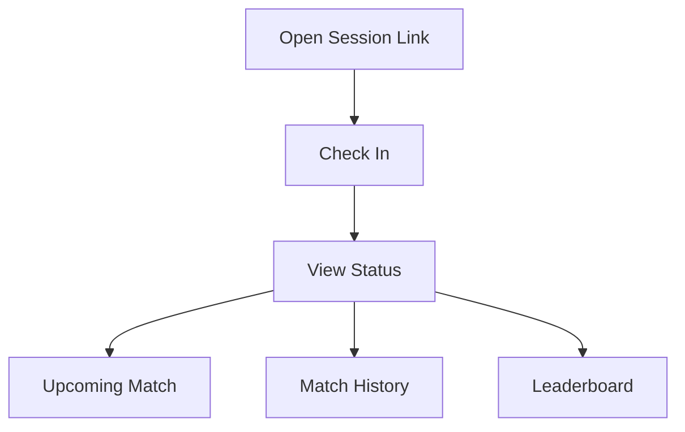

# Player Component Spec

Future version spec. Do not implement player self-service components in MVP v1. The first MVP is an organizer-only app where the organizer manually adds and manages players. Keep these specs to preserve the later direction for player check-in, status, upcoming match, history, and leaderboard experiences.

## Player UX Goal

Player screens should reduce organizer workload. Players should be able to check in, know their status, see their upcoming match, review history, and view the leaderboard without needing the organizer to answer basic questions.

## Main Player Components

- `PlayerCheckInPage`
- `PlayerStatusCard`
- `UpcomingMatchCard`
- `PlayerMatchHistory`
- `LeaderboardView`
- `PlayerProfileSummary`

Detailed player feature specs live in `docs/specs/frontend/features/player/`, and route-level player specs live in `docs/specs/frontend/pages/`. Use this file as the overview and the focused files as implementation contracts.

## Components

### PlayerCheckInPage

Purpose:

- Let a player join a badminton session from a shared link or QR code.

Fields:

- Display name.
- Phone or optional contact field.
- Returning player selector when matched.

Actions:

- Check in as returning player.
- Create guest player and check in.

Rules:

- Do not require full account creation for MVP check-in.
- Avoid exposing organizer-only payment controls.
- After check-in, route player to session status.

### PlayerStatusCard

Purpose:

- Show the player's current session state.

States:

- `waiting`
- `assigned`
- `playing`
- `resting`
- `done`
- `removed`

Displayed data:

- Queue status.
- Approximate wait position if available.
- Court assignment if assigned.
- Payment status if organizer chooses to expose it.

Rules:

- Status text must be clear enough to understand without knowing queue internals.

### UpcomingMatchCard

Purpose:

- Show a published upcoming or active match.

Displayed data:

- Court name.
- Partner.
- Opponents.
- Match status.
- Start time if available.

Rules:

- Do not show speculative suggestions to players until organizer accepts the assignment.

### PlayerMatchHistory

Purpose:

- Show past badminton matches for the player.

Displayed data:

- Date.
- Session name.
- Partner.
- Opponents.
- Result.
- Score.
- Rating change if available.

Rules:

- Keep the list compact on mobile.
- Use plain result labels such as `Won`, `Lost`, `Cancelled`, or `Unscored`.

### LeaderboardView

Purpose:

- Show simple rankings and participation metrics.

Supported sorts:

- Rating, wins, losses, draws, games played, win rate, attendance.

Scopes:

- Club (`/leaderboards/current`) and session (`/sessions/:id/leaderboard`).

Rules:

- Display **W-L-D** on every row; align with `match-results-and-ratings.md`.
- Label ratings as internal club ratings, not official Elo.
- Respect hidden or guest player visibility settings when player-facing views ship.

### PlayerProfileSummary

Purpose:

- Show a player's basic stats.

Displayed data:

- Display name.
- Current rating.
- Matches played.
- Wins.
- Recent form.
- Attendance count.

Rules:

- Do not expose organizer notes to players.

## Player Navigation

Recommended player flow:

## Responsive Behavior

Mobile:

- Single-column pages.
- Large touch targets.
- Current status at top.

Tablet and desktop:

- Allow history and leaderboard to sit beside profile summary.

## MVP Constraints

- Player screens should not include queue master controls.
- Player-facing assignment data should be read-only.
- Account creation should remain optional until organizer workflows are stable.
